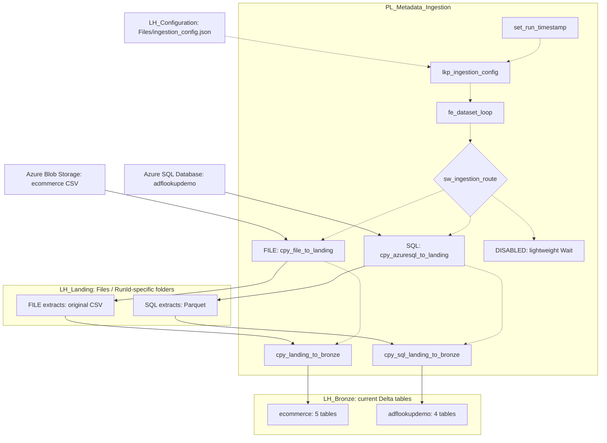

# Microsoft Fabric Metadata-Driven Bronze Ingestion Framework

This project replaces repeated dataset-specific ingestion pipelines with shared orchestration and a JSON dataset catalog. Each record describes a source and Bronze destination; source-specific Copy branches handle movement. This reduces repeated pipeline maintenance while keeping dataset identity, source selection and target naming reviewable.

The demonstrated scope is Azure Blob Storage CSV files and Azure SQL Database tables, staged in Landing and published as full Delta snapshots in Bronze. Landing preserves run-specific input for diagnosis; Bronze provides queryable current state. This is a working ingestion demonstration, not a production-hardened CDC or incremental framework.

**Evidence as of October 8, 2026:** the owner reports nine queryable Bronze tables, 632 rows, and a successful full rerun with unchanged counts. This documentation review did not connect to Fabric. Exact deployed expressions and activity suffixes require Fabric UI verification because `fabric/` has no pipeline export.

**Repository readiness issue:** the uncommitted [configuration](config/ingestion_config.json) now contains valid JSON with ten records: five enabled FILE, four enabled SQL and one disabled REST placeholder. It was updated externally during this review; this documentation task did not edit it. The [validator](tests/validate-config.ps1) still enforces the older SQL `TBD`/disabled contract and fails. Verify catalog parity with Fabric and reconcile the validator before treating the repository as deployment-ready.

## Documentation and repository map

| Resource | Purpose |
| --- | --- |
| [Architecture and decisions](docs/architecture.md) | Boundaries, expressions' provenance, tradeoffs and historical artifacts |
| [Configuration contract](docs/configuration-contract.md) | Field definitions, real record examples, validation and onboarding |
| [Operations runbook](docs/operations-runbook.md) | Preflight, monitoring, troubleshooting, recovery and security |
| [Testing and validation](docs/testing-and-validation.md) | Dated evidence, SQL checks, acceptance layers and untested scenarios |
| [Local configuration](config/ingestion_config.json) | Ten-record local catalog; deployed-file parity not verified |
| [Validator](tests/validate-config.ps1) | Static legacy contract validation; currently fails |
| [Historical notebook](notebooks/NB_Load_Bronze.py) | Retained earlier Spark Bronze implementation; inactive in current flow |
| [Fabric artifacts directory](fabric/) | Placeholder only; reviewed pipeline export still needed |

## Architecture

Solid arrows represent source-data movement. Dotted arrows represent orchestration or configuration. Branch activity names are logical names from supplied context, not verified exact deployed names. Each branch has its own Landing representation inside the same Lakehouse.



The SQL branch does not pass through FILE activities. Configuration controls processing and does not carry source records. DISABLED performs no ingestion according to the supplied architecture; its exact expression and dedicated test result are unverified.

## End-to-end execution

1. `set_run_timestamp` initializes run context. Earlier documentation records String `run_timestamp = @utcNow()`; its current setting and consumers need UI verification. The separate `@pipeline().RunId` identifies the execution and Landing run folder.
2. `lkp_ingestion_config` reads `Files/ingestion_config.json` from `LH_Configuration`. Inspect its actual output before assuming a `firstRow` or `value` shape.
3. `fe_dataset_loop` receives dataset records from Lookup and processes each record. The exact Items expression and sequential/parallel settings are **Requires Fabric UI verification**.
4. `sw_ingestion_route` selects FILE, SQL or DISABLED according to supplied context. The catalog has Boolean `enabled` and `source_type`, but exact expression precedence, case handling and unknown-type behavior cannot be established without the definition. Do not infer them from activity names.
5. FILE copies a Blob file to Landing, then parses Landing CSV into Bronze. Earlier docs record Binary copy using `source.container` and `source.path`, then CSV with headers, comma delimiter and UTF-8. Both copies used directory `@concat(item().source_system,'/',item().dataset_id,'/',pipeline().RunId)` under Files and filename `@item().source.path`. These are historical documented bindings awaiting current UI confirmation.
6. SQL selects source schema/table described in `source`, writes Parquet to Landing, then loads Bronze. The owner confirms this path. Actual schema/table expressions, connection/database binding, Landing directory and filename construction are **Requires Fabric UI verification**. SQL records have no `source.path`; do not assume FILE naming logic applies.
7. Bronze destinations are identified by `bronze.schema` and `bronze.table`. Earlier FILE settings use `@item().bronze.schema` / `@item().bronze.table`; SQL target results are verified by the owner, while exact expressions remain unverified. Overwrite publishes the current full snapshot for each table. This does not create a transaction spanning all datasets.
8. A disabled dataset takes a lightweight Wait according to supplied context. Older `if_dataset_enabled` and test activities are not presented as active. Actual Copy names may include `_copy1`/`_copy2`.

### Trace: dbo.Cars

The local `azuresql_cars` record specifies `source_system: adflookupdemo`, type SQL, alias `azuresql_adflookupdemo`, source `adflookupdemo.dbo.Cars`, Landing `PARQUET`, and Bronze `adflookupdemo.cars`. The supplied source server is `devonadfsqldemo.database.windows.net`. The SQL branch reads the table through a Fabric connection, lands Parquet in `LH_Landing`, then overwrites the target in `LH_Bronze`; 428 rows were verified.

The shared path convention would place this dataset under `Files/adflookupdemo/azuresql_cars/<pipeline-run-id>/`; the exact deployed SQL directory and filename are **Not verified**. Obtain them from Copy's evaluated input/output rather than inventing a filename. The alias is descriptive; automatic connection selection is not evidenced.

### Trace: ecommerce customers

The current local `ecommerce_customers` record identifies `source/customers.csv`, source system `ecommerce`, alias `blob_ecommerce`, and Bronze `ecommerce.customers`. Earlier docs identify Blob account `ecommerceunifiedproject`. The documented FILE path is `LH_Landing/Files/ecommerce/ecommerce_customers/<pipeline-run-id>/customers.csv`, followed by CSV-to-Delta Overwrite. The owner verified 15 Bronze rows on October 8. Compare this local record with the deployed catalog before reuse.

## Fabric component inventory

| Component | Responsibility and interaction |
| --- | --- |
| `WS_Metadata_Bronze_Demo` | Workspace hosting the pipeline and three Lakehouses |
| `LH_Configuration` | Holds JSON read by Lookup; does not stage source data |
| `LH_Landing` | Stores source extracts in run-specific folders: FILE CSV, SQL Parquet |
| `LH_Bronze` | Hosts current queryable Delta snapshots grouped by source system |
| `PL_Metadata_Ingestion` | Coordinates dataset processing and per-source branches |
| `set_run_timestamp` | Initializes timestamp context; distinct from RunId |
| `lkp_ingestion_config` | Retrieves metadata for iteration |
| `fe_dataset_loop` | Iterates records; exact parallelism unverified |
| `sw_ingestion_route` | Routes FILE/SQL/DISABLED; exact expression/default unverified |
| `cpy_file_to_landing` | Blob-to-Landing copy, logical name |
| `cpy_landing_to_bronze` | Landing CSV-to-Bronze copy, logical name |
| `cpy_azuresql_to_landing` | Azure SQL-to-Parquet copy, logical name |
| `cpy_sql_landing_to_bronze` | Landing Parquet-to-Bronze copy, logical name |
| DISABLED Wait | Lightweight skip path; deployed name/duration unverified |
| Fabric connections | External authentication and resource bindings; alias resolution unverified |
| Bronze SQL analytics endpoint | Read/query interface used for owner-reported validation |

## Metadata contract and onboarding

The intended v1 root contains `contract_version`, `landing_path_template` and `datasets`. Each record contains `dataset_id`, Boolean `enabled`, `source_system`, `source_type`, `connection_alias`, `source`, `landing`, `bronze`, `keys` and `load_policy`. See the [complete contract and representative SQL/FILE records](docs/configuration-contract.md).

Identity, source and Bronze fields describe selection and naming. `connection_alias` is a logical label, not a proven dynamic Fabric connection switch. `keys` are reserved/descriptive, not implemented merge logic. `FULL` means the selected object's complete snapshot; `REPLACE_SNAPSHOT` describes replacement of Bronze contents; `NONE` means no business change-history policy. Runtime enforcement of these policy strings and dynamic consumption of the path-template property are **Not verified**.

For another table in the existing Azure SQL database, verify permissions/types and copy a supported SQL record with unique identity and target. Check schema/table expressions, Parquet naming and the connection database; then perform an acceptance test. For another Blob CSV, verify container/path, parsing compatibility and target uniqueness, then test both FILE copies. Neither configuration-only onboarding nor arbitrary file formats have been proven.

A new connection requires provisioning, source-specific authentication, permissions/networking and reviewed pipeline bindings. A new source type additionally requires branch/loader/validation changes. Resolve the current repository catalog/validator mismatch before using local checks as a deployment gate.

## Load semantics and data lifecycle

Each successful extract replaces its table's current Bronze snapshot. If source rows grow, a correct subsequent full load should increase Bronze accordingly; if rows disappear, replacement should remove them from the current snapshot. These growth/deletion scenarios are expected semantics, not completed tests. A rerun with unchanged tested inputs produced the same counts, but counts alone do not prove identical values or safe behavior during every failure.

The empty ServiceRequests source produced a queryable zero-row table. Replacing a previously nonempty table with an empty extract has not been separately tested. An extraction error must not be treated as a legitimate empty source.

Run-scoped Landing preserves historical input separately from current Bronze. Retention duration, immutability enforcement, completion markers and automated cleanup are not established. A failed run can leave incomplete extracts and mixed-age Bronze tables. No cross-table atomicity, general exactly-once guarantee or safe automated replay is demonstrated. Microsoft's [Lakehouse Copy reference](https://learn.microsoft.com/en-us/fabric/data-factory/connector-lakehouse-copy-activity) defines Overwrite as replacing data and schema; project schema-drift handling remains untested.

## Testing and validation

These are **owner-verified October 8, 2026 results**, not queries rerun by this review.

| Source table/file | Bronze table | Rows |
| --- | --- | ---: |
| `dbo.Cars` | `adflookupdemo.cars` | 428 |
| `dbo.Countries` | `adflookupdemo.countries` | 17 |
| `dbo.Movies` | `adflookupdemo.movies` | 112 |
| `dbo.ServiceRequests` | `adflookupdemo.service_requests` | 0 |
| `customers.csv` | `ecommerce.customers` | 15 |
| `orders.csv` | `ecommerce.orders` | 15 |
| `payments.csv` | `ecommerce.payments` | 15 |
| `support_tickets.csv` | `ecommerce.support_tickets` | 15 |
| `web_activities.csv` | `ecommerce.web_activities` | 15 |
| **SQL subtotal** | **4 tables** | **557** |
| **FILE subtotal** | **5 tables** | **75** |
| **Total** | **9 tables** | **632** |

The initial end-to-end execution and subsequent full execution succeeded with unchanged counts. See [reproducible SQL for all nine tables](docs/testing-and-validation.md), including evidence limitations. For example, execute `SELECT COUNT_BIG(*) FROM [adflookupdemo].[cars];` against the **LH_Bronze SQL analytics endpoint**. Original query text was not supplied; documented queries reproduce the checks.

Validation layers answer different questions: editor validation checks structural configuration; activity success shows execution; Copy metrics show available rows/files read/written; Landing inspection confirms the actual extract; Bronze existence distinguishes missing from empty; per-table counts check snapshot size; end-to-end acceptance combines all of these with source reconciliation. A total of 632 alone could hide compensating errors across tables.

Local check:

```powershell
powershell -NoProfile -ExecutionPolicy Bypass -File tests/validate-config.ps1
```

JSON syntax now passes. The validator fails on its obsolete SQL Landing `TBD` requirement and also contains a SQL-disabled rule. Do not interpret that repository failure as a failed deployed Fabric execution, or change tests just to make documentation pass.

## Operations and troubleshooting

Open Monitor or pipeline **Run > View run history**, select a run, then drill into ForEach/Switch and Copy details. Record RunId, affected dataset from evaluated inputs, status, errors and available Copy metrics. See [Microsoft's monitoring instructions](https://learn.microsoft.com/en-us/fabric/data-factory/monitor-copy-activity) and the [project runbook](docs/operations-runbook.md).

For `PathNotFound`, compare both copies' Lakehouse, Files root, dataset/RunId directory, case, filename and format; confirm the producer actually completed. This is a troubleshooting example, not an asserted historical incident. For missing tables, check branch execution, the evaluated Bronze destination, second-copy errors, permissions and SQL endpoint visibility separately from Lakehouse Tables. For connectivity, verify the actual Fabric connection and source authentication/network access. For unexpected counts, reconcile against the source/extract at the relevant capture time and inspect skips or mapping failures.

The confirmed development/repository issues are stale FILE-only documentation and a legacy validator; initially incomplete local JSON was corrected externally during review. No custom audit store or reconciliation table is implemented. Before retrying a partial run, identify changed tables and incomplete extracts; a fresh run can read newer source data and is not automatic replay of the old snapshot.

## Security considerations

Keep connection credentials in approved Fabric connection mechanisms, never in JSON/Git. Actual authentication modes are **Not verified**; verify them per source. Review source read permissions, connection sharing, workspace roles, OneLake/Lakehouse and SQL endpoint access. Landing contains raw source data and is not automatically a security boundary merely because it is a separate Lakehouse.

Apply least privilege and appropriate sensitive-data retention/access controls to both Landing and Bronze. Sanitize operational errors/screenshots; do not record tokens, SAS URLs, raw sensitive records or credential-bearing connection strings. Logical source names are not secrets or deployable connection IDs.

## Design decisions and tradeoffs

JSON makes metadata reviewable; Lookup/ForEach/Switch reuse orchestration while preserving source-specific behavior. Native Copy suits movement without custom transformations; earlier docs record replacing Spark because its startup overhead was disproportionate for small CSVs. SQL Parquet provides a typed intermediate format; RunId folders preserve execution-specific inputs; Delta exposes queryable snapshots. Full overwrite avoids watermark/CDC state at the cost of full reads and writes. A separate configuration Lakehouse separates lifecycle and permission management, but adds another binding.

These are architectural assessments except where historical rationale is explicitly attributed. See the [compact decision log](docs/architecture.md). The retained notebook's schema guards and operational columns are not guarantees of the active Copy paths.

## Limitations and roadmap

| Status | Scope |
| --- | --- |
| Implemented and owner-verified | CSV/SQL ingestion, SQL Parquet Landing, nine Bronze tables, queryable empty SQL target, full rerun with stable counts |
| Implemented but not fully tested | DISABLED route; overwrite under changed inputs; broader data types and mappings |
| Not implemented | Incremental/CDC, REST loader, durable dataset audit/reconciliation, automated safe replay, managed schema evolution |
| Potential future enhancements | Configuration-only onboarding, growth/deletion and failure tests, data-quality checks, observability and retention controls |

Prioritize: (1) capture the deployed catalog/export and reconcile local config/validator; (2) retain reproducible run evidence and prove same-connection onboarding plus row growth/deletion/empty transitions; (3) test partial failures, retries, replay order, concurrency and schema/type changes; (4) add reconciliation/observability and lifecycle controls; (5) evaluate incremental/CDC or REST only against a real requirement. No roadmap item is marked complete by this review.

## Returning to This Project After Six Months

1. Open `DJ8052/fabric-metadata-driven-ingestion` and this README. Inspect `git status` before editing; the October review preserved user changes, including the externally updated ten-record catalog.
2. Open Fabric workspace `WS_Metadata_Bronze_Demo`, inspect `PL_Metadata_Ingestion`, then `LH_Configuration`, `LH_Landing` and `LH_Bronze`. Confirm connections, permissions and current activity names rather than relying on old screenshots.
3. Read the contract, architecture/decisions, runbook and test matrix linked above. Treat the notebook as historical and check whether `fabric/` now contains a reviewed export.
4. Trace Cars or ecommerce customers from the deployed record through the selected connection, evaluated first-copy output, RunId Landing file, second-copy input and Bronze schema/table. Capture the missing SQL filename expression.
5. Validate configuration and pipeline, run a reviewed snapshot, inspect each expected iteration and Landing extract, then execute the nine-table SQL checks. Use current source expectations, not immutable assumptions about October's counts.
6. Before modifying metadata, check catalog synchronization, validator compatibility, unique identities/targets, supported formats, authentication and overwrite scope. An alias edit alone does not onboard a connection.
7. Review the prioritized gaps above. Repository reproducibility and failure testing remain unfinished; a successful demo is not a production recovery guarantee.
