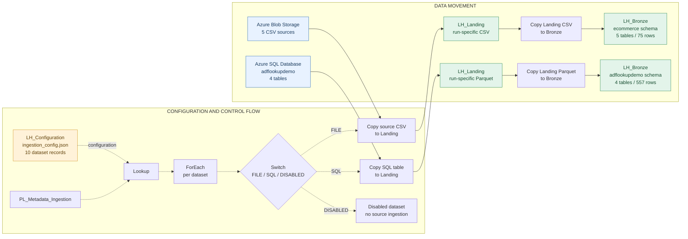

# Microsoft Fabric | Metadata-Driven Bronze Ingestion Framework

**A reusable, configuration-driven data ingestion framework built with Microsoft Fabric Data Factory, Azure SQL Database, Azure Blob Storage, and Delta Lake.**


**Project status:** Working ingestion demonstration | **Last validated:** October 8, 2026 | **Architecture:** Configuration → Orchestration → Landing → Bronze
**Repository:** [fabric-metadata-driven-ingestion](https://github.com/DJ8052/fabric-metadata-driven-ingestion)

---

## 1. Executive Summary

This project demonstrates how to build a metadata-driven ingestion framework using Microsoft Fabric.

Instead of creating and maintaining a separate ingestion pipeline for every source table or file, the framework uses a centralized JSON configuration to define what should be ingested, where the data originates, and where it should be published.

A reusable Fabric pipeline reads this configuration, iterates through the dataset definitions, routes each dataset to the appropriate ingestion process, and loads the resulting data into Delta tables.

### Validated results

| Metric | Result |
|---|---:|
| Supported and tested source types | 2 |
| Enabled datasets | 9 |
| Azure SQL tables ingested | 4 |
| Azure Blob CSV datasets ingested | 5 |
| Bronze Delta tables created | 9 |
| Total verified Bronze rows | 632 |
| Successful full pipeline reruns | Yes |
| Disabled REST dataset | 1 |

**Engineering outcome:** Nine datasets across two source technologies are processed using one shared metadata-driven orchestration pipeline.

The current implementation supports full-snapshot ingestion. Incremental ingestion, CDC, automated recovery, and enterprise-grade observability remain future enhancements.

---

## 2. Business and Engineering Problem

Enterprise data environments commonly contain information distributed across operational databases, cloud storage, applications, and external services.

Traditional ingestion implementations often create a dedicated pipeline for every dataset.

As the number of datasets increases, this approach introduces several challenges:

- Repeated pipeline development and maintenance
- Inconsistent source-to-target naming conventions
- Duplicated orchestration logic
- More complex troubleshooting
- Increased effort when onboarding new datasets
- Limited standardization across source systems

### Architectural approach

Separate **dataset configuration** from **pipeline execution logic**.

The configuration defines the source and destination. The pipeline supplies reusable ingestion behavior.

This creates a foundation for extending ingestion without duplicating the entire orchestration workflow.

---

## 3. Solution Architecture



**Diagram interpretation**

- Dotted arrows: Configuration input and orchestration/routing
- Solid arrows: Source data movement through Copy activities, Landing, and Bronze
- Landing: Run-specific source extracts
- Bronze: Current queryable Delta snapshots

The FILE and SQL branches are separate ingestion paths. Both publish to the same Bronze Lakehouse. The diagram separates control routing from data movement; it does not assert unverified activity dependency settings.

---

## 4. Technology Stack

| Technology | Responsibility |
|---|---|
| Microsoft Fabric | Unified analytics and data engineering platform |
| Fabric Data Factory | Pipeline orchestration and Copy activities |
| Fabric Lakehouse | Configuration, Landing, and Bronze storage |
| Azure Blob Storage | File-based source system |
| Azure SQL Database | Relational source system |
| JSON | Centralized dataset metadata |
| Parquet | Intermediate Landing format for SQL extracts |
| Delta Lake | Queryable Bronze tables |
| SQL Analytics Endpoint | Bronze validation and querying |
| Git / GitHub | Version control and engineering documentation |

### Why Copy activities?

The current workloads primarily require reliable data movement rather than complex distributed transformations.

Fabric Copy activities are sufficient for the demonstrated source-to-Landing and Landing-to-Bronze processes.

Apache Spark is not required merely because the destination is a Lakehouse.

Spark notebooks may become appropriate when the workload requires more complex transformations, specialized parsing, or distributed processing.

---

## 5. Microsoft Fabric Resources

### Workspace

`WS_Metadata_Bronze_Demo`

### Lakehouses

| Lakehouse | Purpose |
|---|---|
| `LH_Configuration` | Stores the centralized ingestion metadata |
| `LH_Landing` | Stores source extracts in execution-specific folders |
| `LH_Bronze` | Stores current Delta snapshots for querying and downstream processing |

### Pipeline

`PL_Metadata_Ingestion`

### Active orchestration components

| Activity | Responsibility |
|---|---|
| `lkp_ingestion_config` | Reads the JSON configuration |
| `fe_dataset_loop` | Iterates through individual dataset records |
| `sw_ingestion_route` | Routes datasets by enabled status and source type |
| FILE Copy activities | Move CSV data through Landing into Bronze |
| SQL Copy activities | Move relational data through Parquet Landing into Bronze |
| DISABLED case | Routes disabled datasets away from FILE and SQL ingestion |

The active Switch replaced an earlier If Condition design.

The deployed Copy activity names may include generated suffixes such as `_copy1` and `_copy2`. Inspect the Fabric pipeline for exact activity identifiers.

Earlier repository documentation mentions a `set_run_timestamp` variable; whether it remains active or is consumed by the current deployment has not been independently verified.

---

## 6. Metadata-Driven Orchestration

The configuration file is stored at:

`LH_Configuration/Files/ingestion_config.json`

The root JSON structure contains:

```json
{
  "contract_version": 1,
  "landing_path_template": "Files/{source_system}/{dataset_id}/{run_id}/",
  "datasets": []
}
```

The `datasets` array contains the individual ingestion definitions.

### 6.1 Lookup activity

Activity:

`lkp_ingestion_config`

The Lookup reads the JSON configuration from the Configuration Lakehouse.

For the current working implementation, the Lookup output contains the root configuration object within the `value` array.

### 6.2 ForEach activity

Activity:

`fe_dataset_loop`

**Verified working Items expression:**

```text
@activity('lkp_ingestion_config').output.value[0].datasets
```

This expression is essential.

The Lookup returns a wrapper object containing:

- `contract_version`
- `landing_path_template`
- `datasets`

The ForEach must iterate over the nested `datasets` array, not the entire wrapper object.

**Development lesson:** Iterating directly over `output.value` caused the Switch to receive the root configuration object. The pipeline failed because `item().enabled` did not exist at that level.

Correcting the ForEach Items expression resolved the error, and the subsequent pipeline run completed successfully.

### 6.3 Switch routing

Activity:

`sw_ingestion_route`

**Verified working Switch expression:**

```text
@if(equals(item().enabled, false), 'DISABLED', item().source_type)
```

Routing behavior:

| Condition | Route |
|---|---|
| `enabled = false` | DISABLED |
| `enabled = true`, `source_type = FILE` | FILE |
| `enabled = true`, `source_type = SQL` | SQL |

This ensures disabled datasets are not routed to their normal ingestion branches.

The current Switch implements FILE, SQL, and DISABLED cases. Other source types are not supported ingestion routes.

---

## 7. Configuration Contract

Each dataset record follows a common metadata structure.

| Property | Purpose |
|---|---|
| `dataset_id` | Unique dataset identifier |
| `enabled` | Controls whether ingestion should execute |
| `source_system` | Logical source-system grouping |
| `source_type` | Determines ingestion routing |
| `connection_alias` | Logical connection identifier |
| `source` | Source-specific database, table, or file properties |
| `landing` | Landing representation |
| `bronze` | Target schema and table |
| `keys` | Reserved source/business key metadata |
| `load_policy` | Describes the intended ingestion and history policy |

### Example: Azure SQL Database

```json
{
  "dataset_id": "azuresql_cars",
  "enabled": true,
  "source_system": "adflookupdemo",
  "source_type": "SQL",
  "connection_alias": "azuresql_adflookupdemo",
  "source": {
    "database": "adflookupdemo",
    "schema": "dbo",
    "table": "Cars"
  },
  "landing": {
    "format": "PARQUET"
  },
  "bronze": {
    "schema": "adflookupdemo",
    "table": "cars"
  },
  "keys": {
    "source_primary_key": null,
    "business_key": null
  },
  "load_policy": {
    "mode": "FULL",
    "bronze_write": "REPLACE_SNAPSHOT",
    "history": "NONE"
  }
}
```

### Example: Azure Blob CSV

```json
{
  "dataset_id": "ecommerce_customers",
  "enabled": true,
  "source_system": "ecommerce",
  "source_type": "FILE",
  "connection_alias": "blob_ecommerce",
  "source": {
    "container": "source",
    "path": "customers.csv",
    "format": "CSV"
  },
  "landing": {
    "format": "CSV"
  },
  "bronze": {
    "schema": "ecommerce",
    "table": "customers"
  },
  "keys": {
    "source_primary_key": null,
    "business_key": null
  },
  "load_policy": {
    "mode": "FULL",
    "bronze_write": "REPLACE_SNAPSHOT",
    "history": "NONE"
  }
}
```

### Important contract distinctions

`connection_alias` is a logical metadata field. Dynamic switching among arbitrary Fabric connections has not been demonstrated.

`keys` is reserved metadata. The current implementation does not perform key-based MERGE operations.

`landing_path_template` documents the directory convention. Its runtime consumption by the pipeline has not been independently verified.

The load-policy fields describe the current full-snapshot design. They should not be interpreted as proof that the pipeline dynamically supports other load modes.

See [Configuration Contract](docs/configuration-contract.md) for additional details.

---

## 8. Ingestion Paths

### 8.1 FILE ingestion

**Source:** Azure Blob Storage | **Input:** CSV | **Landing:** CSV | **Bronze:** Delta

Execution sequence:

1. Read the FILE dataset definition.
2. Resolve the configured Blob container and source path.
3. Copy the source file into `LH_Landing`.
4. Use a RunId-specific Landing directory.
5. Read the Landing CSV.
6. Write the corresponding Delta table in `LH_Bronze`.

Example dataset:

`ecommerce_customers`

Source:

`source/customers.csv`

Landing convention:

```text
LH_Landing/
  Files/
    ecommerce/
      ecommerce_customers/
        {pipeline_run_id}/
          customers.csv
```

This is the documented path convention; inspect the evaluated run path in Fabric before relying on it.

Bronze destination:

`LH_Bronze.ecommerce.customers`

### 8.2 SQL ingestion

**Source:** Azure SQL Database | **Landing:** Parquet | **Bronze:** Delta

Database:

`adflookupdemo`

Execution sequence:

1. Read the SQL dataset definition.
2. Resolve the source schema and table.
3. Copy the Azure SQL table into Landing as Parquet.
4. Use a RunId-specific Landing directory.
5. Read the Landing Parquet file.
6. Overwrite the configured Bronze Delta table.

Example dataset:

`azuresql_cars`

Source:

`adflookupdemo.dbo.Cars`

Landing convention:

```text
LH_Landing/
  Files/
    adflookupdemo/
      azuresql_cars/
        {pipeline_run_id}/
          azuresql_cars.parquet
```

This is an illustrative convention from earlier repository documentation, not an independently verified deployed SQL path or filename. Inspect the evaluated Copy source and sink in Fabric.

Bronze destination:

`LH_Bronze.adflookupdemo.cars`

### Verified dynamic pipeline expressions

The deployed pipeline has been confirmed to use these expressions:

**ForEach Items**

```text
@activity('lkp_ingestion_config').output.value[0].datasets
```

**Switch expression**

```text
@if(equals(item().enabled, false), 'DISABLED', item().source_type)
```

These route enabled FILE and SQL records to their respective branches and disabled records to DISABLED. Exact expressions for SQL source selection, Landing paths, destination selection, and connection binding have not been independently verified from a pipeline export. `connection_alias` is metadata and is not evidence of dynamic selection among arbitrary Fabric connections.

---

## 9. Landing and Bronze Design

### Landing: Execution-specific source extracts

`LH_Landing` retains source extracts under RunId-specific directories.

Benefits include:

- Separating source extraction from Bronze publication
- Locating the input associated with a particular execution
- Supporting troubleshooting and source-data inspection
- Reducing the risk of overwriting the previous run's Landing files

Run-scoped storage is not, by itself, proof of immutable retention or automated replay.

### Bronze: Current source snapshots

`LH_Bronze` contains Delta tables representing the current successfully published full snapshot for each dataset.

Current write behavior:

`Overwrite`

The intended metadata policy is:

```json
{
  "mode": "FULL",
  "bronze_write": "REPLACE_SNAPSHOT",
  "history": "NONE"
}
```

If the source gains or loses records, a subsequent successful full-snapshot load should reflect that change in Bronze.

The current project has verified reruns with unchanged row counts. Source growth, deletion, and recovery scenarios remain to be tested.

**Important:** Snapshot replacement occurs at the individual table level. The pipeline does not demonstrate an atomic transaction across all nine tables.

---

## 10. Verified Test Results

**Validation date: October 8, 2026**

The full pipeline completed successfully, and the Bronze SQL analytics endpoint was used to verify the resulting tables and row counts.

### Azure SQL Database

| Source | Bronze table | Rows |
|---|---|---:|
| `dbo.Cars` | `adflookupdemo.cars` | 428 |
| `dbo.Countries` | `adflookupdemo.countries` | 17 |
| `dbo.Movies` | `adflookupdemo.movies` | 112 |
| `dbo.ServiceRequests` | `adflookupdemo.service_requests` | 0 |
| **SQL total** | **4 tables** | **557** |

### Azure Blob Storage

| Source file | Bronze table | Rows |
|---|---|---:|
| `customers.csv` | `ecommerce.customers` | 15 |
| `orders.csv` | `ecommerce.orders` | 15 |
| `payments.csv` | `ecommerce.payments` | 15 |
| `support_tickets.csv` | `ecommerce.support_tickets` | 15 |
| `web_activities.csv` | `ecommerce.web_activities` | 15 |
| **FILE total** | **5 tables** | **75** |

### Combined results

**9 Bronze Delta tables | 632 rows | 2 tested source types**

A subsequent successful execution using the updated nested JSON configuration produced the same Bronze row counts.

### Empty-table handling

The Azure SQL `ServiceRequests` source contained zero records.

The ingestion completed successfully and produced a queryable Bronze table containing zero rows.

This verifies handling of an initially empty source table. It does not establish behavior when an existing nonempty Bronze table is replaced by an empty extract.

---

## 11. SQL Validation Queries

Run the following queries against the `LH_Bronze` SQL analytics endpoint.

```sql
-- Azure SQL source datasets

SELECT 'Cars' AS dataset_name, COUNT_BIG(*) AS row_count
FROM [adflookupdemo].[cars]

UNION ALL

SELECT 'Countries', COUNT_BIG(*)
FROM [adflookupdemo].[countries]

UNION ALL

SELECT 'Movies', COUNT_BIG(*)
FROM [adflookupdemo].[movies]

UNION ALL

SELECT 'ServiceRequests', COUNT_BIG(*)
FROM [adflookupdemo].[service_requests];
```

```sql
-- Azure Blob ecommerce datasets

SELECT 'Customers' AS dataset_name, COUNT_BIG(*) AS row_count
FROM [ecommerce].[customers]

UNION ALL

SELECT 'Orders', COUNT_BIG(*)
FROM [ecommerce].[orders]

UNION ALL

SELECT 'Payments', COUNT_BIG(*)
FROM [ecommerce].[payments]

UNION ALL

SELECT 'SupportTickets', COUNT_BIG(*)
FROM [ecommerce].[support_tickets]

UNION ALL

SELECT 'WebActivities', COUNT_BIG(*)
FROM [ecommerce].[web_activities];
```

### Validation checklist

- Pipeline execution succeeded
- Expected dataset iterations executed
- Source-specific routing completed
- Landing files were created
- Bronze tables were available for querying
- Individual Bronze row counts matched the observed expectations
- Full rerun completed with unchanged counts

Row-count validation is necessary but does not establish full record-level equality or source-to-target reconciliation under all conditions.

See [Testing and Validation](docs/testing-and-validation.md).

---

## 12. Operating the Pipeline

### Execute

1. Open Microsoft Fabric.
2. Navigate to `WS_Metadata_Bronze_Demo`.
3. Open `PL_Metadata_Ingestion`.
4. Validate the pipeline.
5. Select **Run**.
6. Open the pipeline execution details.
7. Inspect the ForEach iterations and Switch branches.
8. Verify the Copy activity results.
9. Query the Bronze SQL analytics endpoint.

### Troubleshoot a failed execution

Start with the first failed activity, not merely the outer ForEach error.

| Symptom | Investigation |
|---|---|
| Missing `enabled` property | Check ForEach Items expression and Lookup output shape |
| Wrong Switch branch | Check `enabled`, `source_type`, and Switch expression |
| Azure SQL connection failure | Check Fabric connection, source availability, authentication, and network access |
| Landing file missing | Check RunId, dataset path, filename, and first Copy execution |
| Bronze table missing | Check second Copy activity, destination schema/table, and SQL endpoint visibility |
| Unexpected row count | Compare source records, Copy metrics, Landing extract, and Bronze table |
| JSON parsing error | Validate JSON syntax and root structure |

### Confirmed development issue: Lookup wrapper

The pipeline failed when ForEach passed the entire JSON wrapper object to the Switch.

The error identified available properties:

```text
contract_version
landing_path_template
datasets
```

The resolution was:

```text
@activity('lkp_ingestion_config').output.value[0].datasets
```

After the correction, the pipeline succeeded and the Bronze row counts matched the previous results.

This is an important example of why pipeline expressions must be based on the actual runtime output structure.

See [Operations Runbook](docs/operations-runbook.md).

---

## 13. Adding New Datasets

The intended onboarding workflow is:

1. Identify the source system and dataset.
2. Confirm the source connection and permissions.
3. Confirm that the source type is supported.
4. Add a unique dataset definition to the JSON configuration.
5. Specify source and Bronze properties.
6. Validate the configuration.
7. Execute the pipeline.
8. Inspect the correct routing branch.
9. Verify Landing and Bronze outputs.
10. Reconcile source and destination records.

### Supported onboarding scenarios

Adding another table to the existing Azure SQL connection is a candidate for configuration-only onboarding, provided the table is compatible with the current Copy activities and permissions.

Adding another compatible CSV file to the existing Blob source follows the same principle.

**A configuration-only onboarding acceptance test has not yet been performed.**

Introducing a new source connection may require connection provisioning and pipeline changes.

Introducing a new source type requires a supported ingestion branch.

---

## 14. Engineering Decisions

| Decision | Rationale and tradeoff |
|---|---|
| Central JSON configuration | Keeps dataset definitions separate from pipeline logic |
| Lookup + ForEach | Reuses orchestration across dataset records |
| Switch routing | Separates source-specific ingestion behavior |
| Three Lakehouses | Separates configuration, raw Landing extracts, and Bronze publication |
| Parquet for SQL Landing | Provides a structured intermediate representation |
| CSV preservation for FILE Landing | Retains the original file representation |
| RunId-based directories | Associates Landing extracts with individual executions |
| Delta in Bronze | Supports queryable Lakehouse tables |
| Full-snapshot overwrite | Simpler initial implementation, but requires full extraction and replacement |
| No Spark in active ingestion | Avoids unnecessary custom processing for straightforward data movement |

These choices are appropriate for the demonstrated project scope, not universal prescriptions for every enterprise workload.

For deeper architectural context, see [Architecture and Decisions](docs/architecture.md).

---

## 15. Security and Governance

The metadata file should never contain passwords, tokens, or connection secrets.

Source authentication is configured through Fabric connections rather than credentials embedded in the repository. The deployed authentication modes and connection bindings have not been independently inspected.

Production considerations include:

- Least-privilege source access
- Appropriate Fabric workspace and Lakehouse permissions
- Sensitive-data classification
- Access control for Landing and Bronze
- Retention policies for run-specific Landing files
- Credential rotation and connection ownership
- Auditability and operational logging

A separate Landing Lakehouse does not automatically provide a security boundary or guarantee that sensitive information has been excluded.

---

## 16. Current Limitations and Roadmap

| Capability | Status |
|---|---|
| Metadata-driven FILE ingestion | Implemented and tested |
| Metadata-driven Azure SQL ingestion | Implemented and tested |
| Run-specific Landing folders | Implemented |
| Full-snapshot Bronze overwrite | Implemented and tested with stable inputs |
| Disabled-dataset routing | Implemented; separate acceptance evidence limited |
| Empty SQL source ingestion | Tested |
| Configuration-only dataset onboarding | Not yet tested |
| Source row growth/deletion handling | Not yet tested |
| Incremental ingestion / CDC | Not implemented |
| REST ingestion | Not implemented |
| Automated data reconciliation | Not implemented |
| Failure injection and recovery testing | Not completed |
| Automated schema-drift management | Not implemented |
| Durable operational audit framework | Not implemented |

### Recommended next engineering milestones

**Phase 1 — Extensibility testing**

Add another Azure SQL table through configuration alone, without changing the pipeline. Verify source-to-target results.

**Phase 2 — Snapshot correctness**

Add and remove source records. Verify Bronze reflects the new source snapshot after a successful rerun.

**Phase 3 — Failure and recovery**

Test connection failures, missing files, partial execution, retries, and replay behavior.

**Phase 4 — Operational controls**

Introduce dataset-level execution logging, source-to-target reconciliation, error classification, and retention policies.

**Phase 5 — Additional ingestion patterns**

Evaluate incremental ingestion, CDC, and REST integration based on actual requirements.

---

## 17. Repository Navigation

| Resource | Description |
|---|---|
| [Configuration JSON](config/ingestion_config.json) | Dataset definitions and ingestion metadata |
| [Architecture](docs/architecture.md) | Architecture and engineering decisions |
| [Configuration Contract](docs/configuration-contract.md) | Metadata field definitions and usage |
| [Operations Runbook](docs/operations-runbook.md) | Execution, troubleshooting, and recovery guidance |
| [Testing and Validation](docs/testing-and-validation.md) | Validation results and outstanding tests |
| [Configuration Validator](tests/validate-config.ps1) | Local configuration checks |
| [Notebooks](notebooks/) | Historical or supporting notebook artifacts |
| [Fabric Artifacts](fabric/) | Fabric-related repository artifacts |

### Repository validation note

The local validator checks the current v1 JSON structure, FILE and SQL metadata, Bronze destinations, enabled flags, and full-snapshot load-policy values. The disabled REST record is checked as metadata only; the validator does not imply REST support. Run `powershell -NoProfile -ExecutionPolicy Bypass -File tests\validate-config.ps1` from the repository root. A local validation pass does not inspect the deployed Fabric catalog or prove pipeline execution.

---

## 18. Returning to This Project After Six Months

Use this section to reconstruct the working environment.

### Step 1 — Review the architecture

Start with this README and the Mermaid diagram.

Understand the separation between:

- Configuration
- Orchestration
- Landing
- Bronze

### Step 2 — Open the Fabric workspace

Workspace:

`WS_Metadata_Bronze_Demo`

Locate:

```text
PL_Metadata_Ingestion
LH_Configuration
LH_Landing
LH_Bronze
```

### Step 3 — Inspect the configuration

Open:

`LH_Configuration/Files/ingestion_config.json`

Compare the deployed configuration against:

`config/ingestion_config.json`

Confirm the current enabled datasets, source connections, and Bronze destinations.

### Step 4 — Inspect the pipeline

Review the following sequence:

```text
lkp_ingestion_config
    ↓
fe_dataset_loop
    ↓
sw_ingestion_route
    ├── FILE
    ├── SQL
    └── DISABLED
```

Verify the two critical expressions.

**ForEach Items**

```text
@activity('lkp_ingestion_config').output.value[0].datasets
```

**Switch expression**

```text
@if(equals(item().enabled, false), 'DISABLED', item().source_type)
```

### Step 5 — Trace one dataset

Use `azuresql_cars`.

Follow the record through:

1. JSON configuration
2. Lookup output
3. ForEach iteration
4. SQL Switch branch
5. Azure SQL source
6. Landing Parquet file
7. Bronze Delta table
8. SQL validation query

Repeat with `ecommerce_customers` to understand the FILE branch.

### Step 6 — Execute and validate

Run the pipeline, inspect the activity details, and query all nine Bronze tables.

The October 8, 2026 baseline is 632 rows.

Future source data may change, so the original row counts should be treated as historical test evidence rather than permanent expected values.

### Step 7 — Review outstanding work

Before expanding the framework, prioritize:

- Verify deployed connection bindings, Landing paths, and timestamp-variable usage
- Configuration-only onboarding test
- Source change and snapshot replacement test
- Failure/retry testing
- Operational audit and reconciliation design

---

## 19. Project Summary

This project demonstrates practical Microsoft Fabric data engineering capabilities:

- Metadata-driven ingestion design
- Multi-source orchestration
- Dynamic dataset iteration
- Conditional source routing
- Azure SQL and Azure Blob integration
- Landing and Bronze Lakehouse architecture
- Delta table publication
- SQL-based validation
- Troubleshooting using actual pipeline execution results
- Git-based engineering documentation

**Validated outcome:** Nine source datasets successfully ingested into nine Bronze Delta tables, with 632 verified rows and successful repeat executions.

The implementation establishes a working foundation for a larger metadata-driven ingestion platform while explicitly identifying the capabilities that still require engineering and validation.

---

**Built with Microsoft Fabric, Azure SQL Database, Azure Blob Storage, Delta Lake, and GitHub.**
